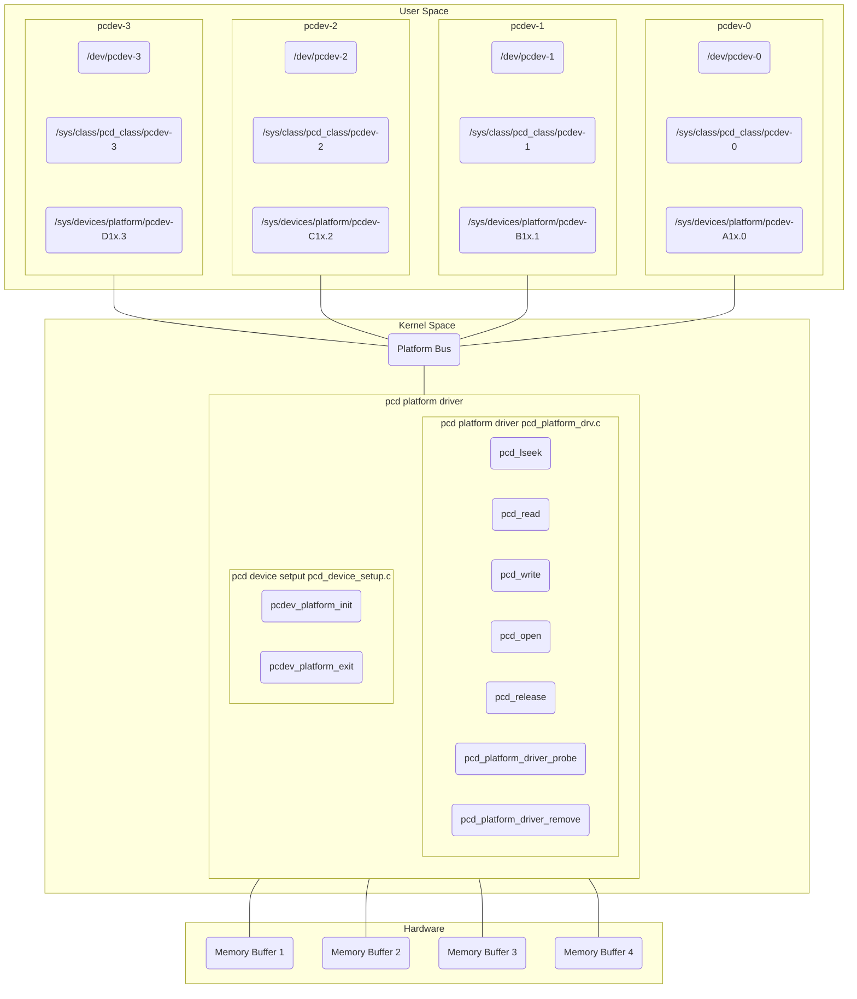

# Pseudo Character Device Platform Driver

This is a multi device platform driver implementation, the driver is divided into two kernel objects:
- [pcd_device_setup](pcd_device_setup.c): in this module 4 platform devices (pcdev-x with x from 0 to 3) are created and initialized. In this module the platform devices are registered with the linux kernel.
- [pcd_platform_drv](pcd_platform_drv.c): in this module all device files are created and all file operations are implemented.

The driver manages one memory region in the hardware for each device (4 devices are implemented), allowing to the user to access this memory for performing write and read operations. Each device has some particular data like the buffer memory size, a serial number and an access permission. These data are stored in a ```pcdev_platform_data``` struct in the [pcd_device_setup.c](pcd_device_setup.c) file and they are listed below:

|                    | pcdev-0      | pcdev-1      | pcdev-2      | pcdev-3      |
|:------------------:|:------------:|:------------:|:------------:|:------------:|
| Size (bytes)       | 512          | 1024         | 128          | 32           |
| Serial Number      | PCDEVABC1111 | PCDEVXYZ2222 | PCDEVXYZ3333 | PCDEVXYZ4444 |
| Access Permissions | RDWR         | RDWR         | RDONLY       | WRONLY       |

The needed memory for each driver is reserved dinamically using [devm_kmalloc](https://docs.kernel.org/driver-api/driver-model/devres.html) function in the probe process. You can notice there is not any call to ```devm_kfree``` function in the probe function if a failure happens; this is due to the probe function is called by the ```really_probe``` function (you can check this function in the [dd.c](https://github.com/torvalds/linux/blob/master/drivers/base/dd.c) file), and in this function, if the bind process fails, the ```devres_release_all``` function is called. This function releases all reserved resources done during the probe process; for this reason any call to ```devm_kfree``` function is not needed.

This driver implements:  
- llseek as pcd_llseek.
- read as pcd_read.
- write as pcd_write.
- open as pcd_open.
- release as pcd_release.

This driver binds the platform device with the platform driver using an id table process. You can check the match process in the ```platform_match``` function in the [platform.c](https://github.com/torvalds/linux/blob/master/drivers/base/platform.c) file in the kernel sources; in this function there is a call to ```platform_match_id``` function which returns a ```platform_device_id``` struct if the match was done successfully. This struct is defined in [pcd_platform_drv.c](pcd_platform_drv.c) file as an array of 4 elements (one per device):
```c
struct platform_device_id pcdevs_ids[] = {
    [0] = {.name = "pcdev-A1x", .driver_data = PCDEVA1X},
    [1] = {.name = "pcdev-B1x", .driver_data = PCDEVB1X},
    [2] = {.name = "pcdev-C1x", .driver_data = PCDEVC1X},
    [3] = {.name = "pcdev-D1x", .driver_data = PCDEVD1X},
    {} /* Null termination */
};
```
In addition some dummy configuration parameters are set for each driver; these parameters are configured using the ```driver_data``` field of the ```platform_device_id``` struct. You can find this configuration in the table below:

|                    | pcdev-0      | pcdev-1      | pcdev-2      | pcdev-3      |
|:------------------:|:------------:|:------------:|:------------:|:------------:|
| Config item 1      | 60           | 50           | 40           | 30           |
| Config item 2      | 21           | 22           | 23           | 24           |

When the driver is registered in the platform bus the user can access to the devices in ```/dev/pcdev-1```, ```/dev/pcdev-2```, ```/dev/pcdev-3```, ```/dev/pcdev-4```.  

A diagram showing an overview is here:



## Compile

You can compile this driver using the Makefile:
```console
make host
```
Then you will get two .ko files: pcd_device_setup.ko and pcd_platform_drv.ko.

## Test

You can install both kernel objects:
```console
sudo insmod pcd_device_setup.ko
sudo insmod pcd_platform_drv.ko
```
You can also remove the driver using:
```console
sudo rmmod pcd_platform_drv
sudo rmmod pcd_device_setup
```
You can get the print information of these operations doing ```dmesg```, here my log when installing and removing the driver:
```console
[ 9282.628632] pcdev_platform_init : Device setup module loaded
[ 9299.563670] pcd_platform_driver_probe : A device is detected
[ 9299.563676] pcd_platform_driver_probe : Device serial number = PCDEVABC1111
[ 9299.563677] pcd_platform_driver_probe : Device size = 512
[ 9299.563679] pcd_platform_driver_probe : Device permission = 17
[ 9299.563680] pcd_platform_driver_probe : Config item 1 = 60
[ 9299.563681] pcd_platform_driver_probe : Config item 2 = 21
[ 9299.564031] pcd_platform_driver_probe : Probe was successful
[ 9299.564046] pcd_platform_driver_probe : A device is detected
[ 9299.564048] pcd_platform_driver_probe : Device serial number = PCDEVXYZ2222
[ 9299.564049] pcd_platform_driver_probe : Device size = 1024
[ 9299.564050] pcd_platform_driver_probe : Device permission = 17
[ 9299.564051] pcd_platform_driver_probe : Config item 1 = 50
[ 9299.564052] pcd_platform_driver_probe : Config item 2 = 22
[ 9299.564127] pcd_platform_driver_probe : Probe was successful
[ 9299.564144] pcd_platform_driver_probe : A device is detected
[ 9299.564146] pcd_platform_driver_probe : Device serial number = PCDEVXYZ3333
[ 9299.564147] pcd_platform_driver_probe : Device size = 128
[ 9299.564149] pcd_platform_driver_probe : Device permission = 1
[ 9299.564150] pcd_platform_driver_probe : Config item 1 = 40
[ 9299.564151] pcd_platform_driver_probe : Config item 2 = 23
[ 9299.564190] pcd_platform_driver_probe : Probe was successful
[ 9299.564201] pcd_platform_driver_probe : A device is detected
[ 9299.564202] pcd_platform_driver_probe : Device serial number = PCDEVXYZ4444
[ 9299.564203] pcd_platform_driver_probe : Device size = 32
[ 9299.564204] pcd_platform_driver_probe : Device permission = 16
[ 9299.564206] pcd_platform_driver_probe : Config item 1 = 30
[ 9299.564207] pcd_platform_driver_probe : Config item 2 = 24
[ 9299.564241] pcd_platform_driver_probe : Probe was successful
[ 9299.564256] pcd_platform_driver_init : pcd platform driver loaded
[ 9448.738942] pcd_platform_driver_remove : Device is removed
[ 9448.739054] pcd_platform_driver_remove : Device is removed
[ 9448.739125] pcd_platform_driver_remove : Device is removed
[ 9448.739172] pcd_platform_driver_remove : Device is removed
[ 9448.739195] pcd_platform_driver_cleanup : pcd platform driver unloaded
[ 9455.315129] pcdev_release : Device released
[ 9455.315154] pcdev_release : Device released
[ 9455.315176] pcdev_release : Device released
[ 9455.315194] pcdev_release : Device released
[ 9455.315196] pcdev_platform_exit : Device setup module unloaded
```
