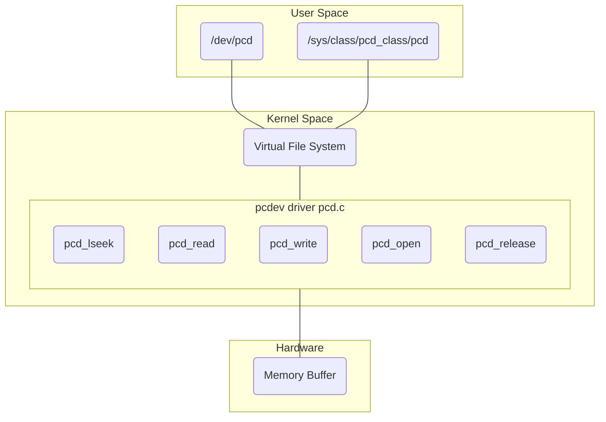

# Pseudo Char Driver

This is a pseudo character driver implementation.  
The driver manages a memory region in the hardware allowing to the user to access this memory for performing write and read operations. This region is defined as ```char device_buffer[DEV_MEM_SIZE];``` where ```DEV_MEM_SIZE``` is set to 512 bytes.  
This driver implements:  
- llseek as pcd_llseek.
- read as pcd_read.
- write as pcd_write.
- open as pcd_open.
- release as pcd_release.

When the driver is registered in the virtual file system (VFS) the user can access to the driver in ```/dev/pcd``` and ```/sys/class/pcd_class/pcd```.  
A diagram showing an overview is here:



## Compile

For compiling you can use:
```console
make host
```

For loading the kernel object:
```console
sudo insmod pcd.ko 
```

You can watch the printed information using (this command shows the last 5 lines of dmesg output):
```console
dmesg | tail -5
```
## Test

For testing the write function:
```console
echo "Hello, I am a linux user" > /dev/pcd 
dmesg | tail -8
```

You will get an output like this:
```console
[  474.722033] pcd_driver_init : Device number <major>:<minor> = 234:0
[  474.722377] pcd_driver_init : Module init was successful
[  976.007133] pcd_open : open was successful
[  976.007214] pcd_write : write requested for 25 bytes
[  976.007223] pcd_write : current file position = 0
[  976.007232] pcd_write : number of bytes successfully written = 25
[  976.007239] pcd_write : updated file position = 25
[  976.007293] pcd_release : release was successful
```

You can check the read function:
```console
cat /dev/pcd 
dmesg | tail -10
```

You will get an output like this (the number of read bytes is 512 because it is the size of the memory driver):
```console
[ 1193.243847] pcd_open : open was successful
[ 1193.243862] pcd_read : read requested for 131072 bytes
[ 1193.243864] pcd_read : current file position = 0
[ 1193.243866] pcd_read : number of bytes successfully read = 512
[ 1193.243867] pcd_read : updated file position = 512
[ 1193.243879] pcd_read : read requested for 131072 bytes
[ 1193.243880] pcd_read : current file position = 512
[ 1193.243881] pcd_read : number of bytes successfully read = 0
[ 1193.243882] pcd_read : updated file position = 512
[ 1193.243890] pcd_release : release was successful
```
You can also test an error for no memory space in the driver:
```console
cp test_file /dev/pcd
dmesg | tail -9
```

You will get an output like this:
```console
[ 2064.957977] pcd_open : open was successful
[ 2064.958066] pcd_write : write requested for 1024 bytes
[ 2064.958073] pcd_write : current file position = 0
[ 2064.958078] pcd_write : number of bytes successfully written = 512
[ 2064.958082] pcd_write : updated file position = 512
[ 2064.958089] pcd_write : write requested for 512 bytes
[ 2064.958092] pcd_write : current file position = 512
[ 2064.958096] pcd_write : No space left on the device
[ 2064.958280] pcd_release : release was successful
```
