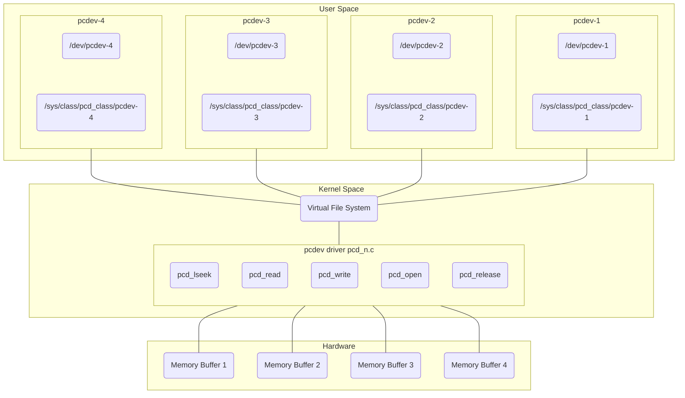

# Pseudo Char Driver for Multiple Devices

This is a multi device pseudo character driver implementation.  
The driver manages one memory region in the hardware for each device (4 devices are implemented), allowing to the user to access this memory for performing write and read operations. This region is defined as ```char device_buffer_pcdevx[MEM_SIZE_MAX_PCDEVX];``` for x from 1 to 4. Each device has some particular data in addition of the memory size, these are a serial number and an access permission. These data are listed below:

|                    | pcdev-1      | pcdev-2      | pcdev-3      | pcdev-4      |
|:------------------:|:------------:|:------------:|:------------:|:------------:|
| Size (bytes)       | 1024         | 512          | 1024         | 512          |
| Serial Number      | PCDEV1XYZ123 | PCDEV2XYZ123 | PCDEV3XYZ123 | PCDEV4XYZ123 |
| Access Permissions | RDONLY       | WRONLY       | RDWR         | RDWR         |

This driver implements:  
- llseek as pcd_llseek.
- read as pcd_read.
- write as pcd_write.
- open as pcd_open.
- release as pcd_release.

When the driver is registered in the virtual file system (VFS) the user can access to the devices in ```/dev/pcdev-1```, ```/dev/pcdev-2```, ```/dev/pcdev-3```, ```/dev/pcdev-4```.  
A diagram showing an overview is here:



## Compile

For compiling the driver:
```console
make host
```

## Test

For loading the kernel object:
```console
sudo insmod pcd_n.ko
dmesg | tail -5
```

You will get an output like this:
```console
[ 5930.575731] pcd_driver_init : Device number <major>:<minor> = 234:0
[ 5930.576019] pcd_driver_init : Device number <major>:<minor> = 234:1
[ 5930.576069] pcd_driver_init : Device number <major>:<minor> = 234:2
[ 5930.576105] pcd_driver_init : Device number <major>:<minor> = 234:3
[ 5930.576140] pcd_driver_init : Module init was successful
```

You can list the created devices (it should be 4 devices):
```console
ls -l /dev/pcdev-*
```

Trying to write in device 1:
```console
echo hello > /dev/pcdev-1
dmesg | tail -2
```

You will get an error due to this device has only read permission:
```console
[ 5960.275978] pcd_open : minor access = 0
[ 5960.275985] pcd_open : open was unsuccessful
```

Other way to test the write permission in device 1:
```console
strace dd if=pcd_n.c of=/dev/pcdev-1
```

In the output of this command you will find this line:
```console
openat(AT_FDCWD, "/dev/pcdev-1", O_WRONLY|O_CREAT|O_TRUNC, 0666) = -1 EPERM (Operation not permitted)
```

You can try writing in device 2 (I use count=1 for avoiding to request more than once write process and generate an no memory error):
```console
dd if=pcd_n.c of=/dev/pcdev-2 count=1
```

You will get an output like this:
```console
1+0 records in
1+0 records out
512 bytes copied, 0.000130635 s, 3.9 MB/s
```

And using ```dmesg```:
```console
[ 6920.575835] pcd_open : minor access = 1
[ 6920.575842] pcd_open : open was successful
[ 6920.575867] pcd_write : write requested for 512 bytes
[ 6920.575869] pcd_write : current file position = 0
[ 6920.575871] pcd_write : number of bytes successfully written = 512
[ 6920.575873] pcd_write : updated file position = 512
[ 6920.575888] pcd_release : release was successful
```

You can test the reading of device 2:
```console
dd if=/dev/pcdev-2 of=file.txt count=1
```

You will get an error like this:
```console
dd: failed to open '/dev/pcdev-2': Operation not permitted
```

If you try the write and read process in device 3 (with bs=100 you order to write only 100 bytes):
```console
dd if=pcd_n.c of=/dev/pcdev-3 count=1 bs=100
```

The output:
```console
1+0 records in
1+0 records out
100 bytes copied, 0.000223722 s, 447 kB/s
```

The ```dmesg``` output:
```console
[ 7331.087137] pcd_open : minor access = 2
[ 7331.087154] pcd_open : open was successful
[ 7331.087204] pcd_write : write requested for 100 bytes
[ 7331.087206] pcd_write : current file position = 0
[ 7331.087208] pcd_write : number of bytes successfully written = 100
[ 7331.087210] pcd_write : updated file position = 100
[ 7331.087237] pcd_release : release was successful
```

For reading the device 3:
```console
cat /dev/pcdev-3
```

The output:
```console
#include <linux/module.h>
#include <linux/fs.h>
#include <linux/cdev.h>
#include <linux/device.h>
#i
```

The ```dmesg``` output (observe the number of read bytes is 1024, the size of the memory for this device):
```console
[ 7852.730835] pcd_open : open was successful
[ 7852.730847] pcd_read : read requested for 131072 bytes
[ 7852.730849] pcd_read : current file position = 0
[ 7852.730853] pcd_read : number of bytes successfully read = 1024
[ 7852.730854] pcd_read : updated file position = 1024
[ 7852.730869] pcd_read : read requested for 131072 bytes
[ 7852.730870] pcd_read : current file position = 1024
[ 7852.730871] pcd_read : number of bytes successfully read = 0
[ 7852.730873] pcd_read : updated file position = 1024
[ 7852.730882] pcd_release : release was successful
```

## Using test_read Application:

You can compile an application for testing the reading. This application read data from device 3. For compiling:
```console
make test
```

You need to write some data into the device 3 (write, at least, 100 or 200 bytes):
```console
echo "bla bla bla ... bla bla" > /dev/pcdev-3
```

Then you can read, for example, the first 100 bytes executing:
```console
./test_read 100
```
